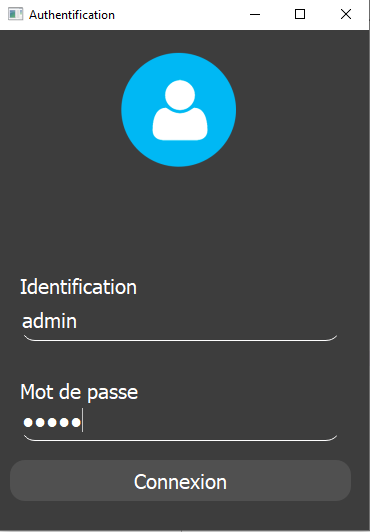
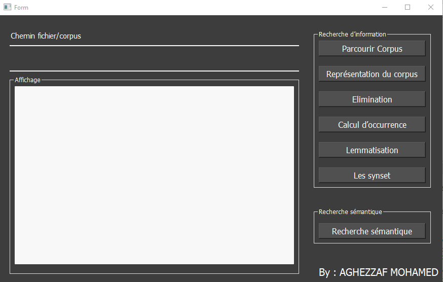
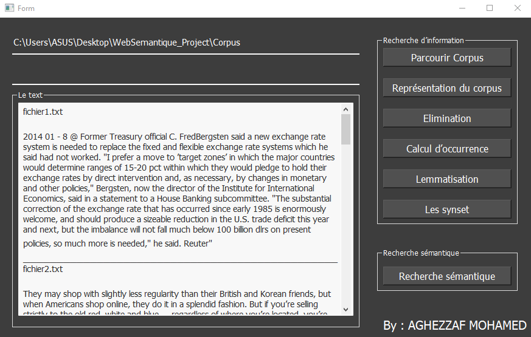
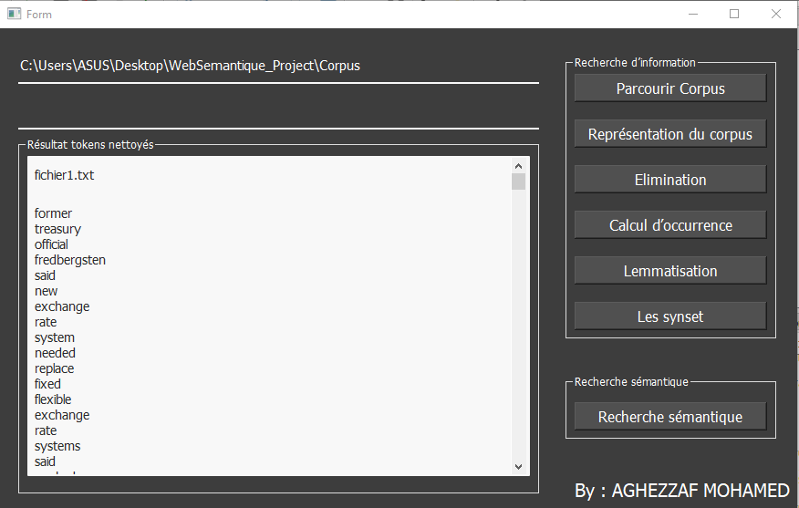
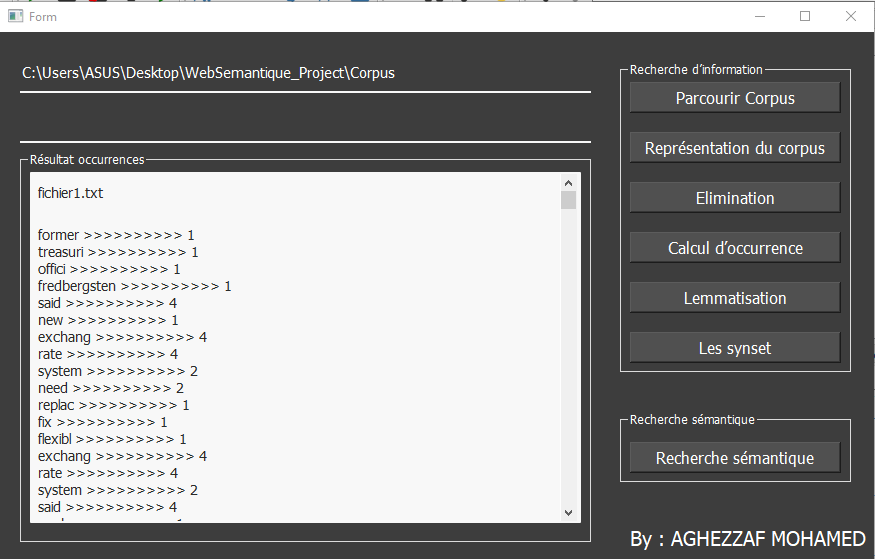
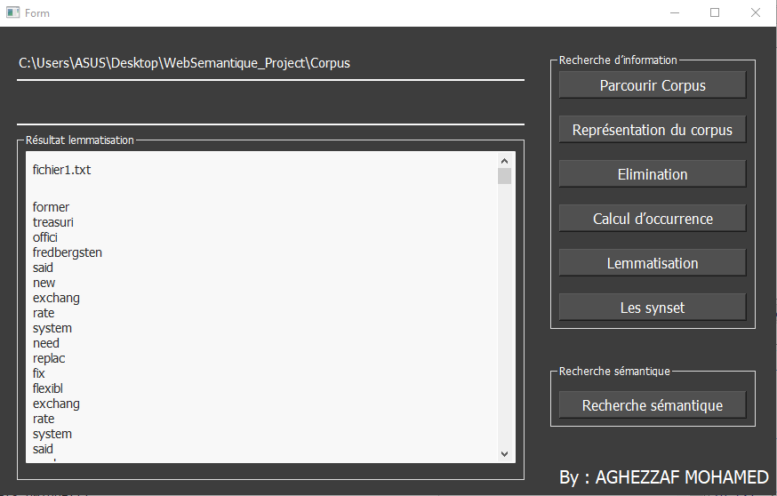
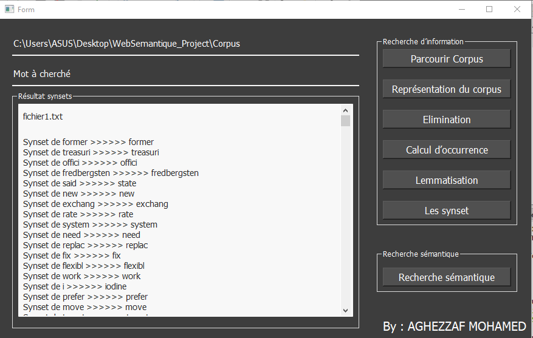
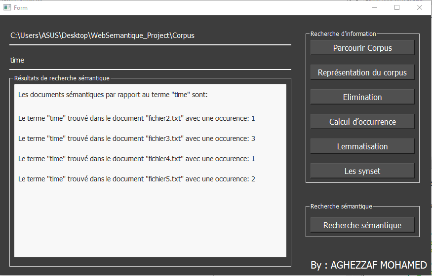

# SemanticWeb_Application
Use of "WordNet" for semantic indexing and information retrieval
## Corpus indexing
### Authentication Interface

 
### Main Interface

 
### Browse corpus
This figure represents the way of filling the database with the words of the texts.

 
### Representation phase of the "bag of words" corpus
This figure shows the tokenization step of the entered text.

 
### Function words elimination phase
In the following figure we present the cleaned tokens, eliminating Function words (using the empty English word list).
In this phase we eliminated stop words, numbers, special characters, and we converted all words into lowercase.

 
### Occurrence calculation phase
In this phase we calculates the frequency of each term existing in the document.

 
### Lemmatization phase
This phase shows each word with its lemma using WordNet.

 
### Synset phase
This phase shows each word with its first synset using WordNet.

## Information retrieval
### Semantic search
The last phase of our application is the semantic search in the database.

